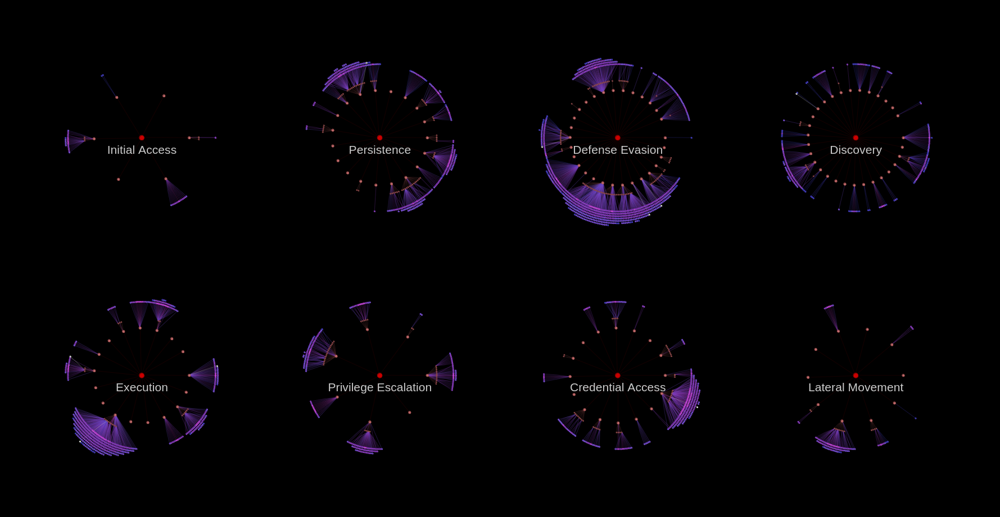

# DEFRA



## 1. Name
The name DEFRA is a simple shorthand for DEfense FRAmework, thus should be pronouced *dē-fra*. 

## 2. Directory structure:
```
- DSystems
    - AV.json
    - EDR.json
    - MDE.json
- DTechniques
    - AV
        - Mimikatz-has-been-blocked.json
    - MDE
        - An-anomalous-scheduled-task-was-created.json
- Mitigations
    - Induction-training-for-new-employees.json
- attack.py
- defend.py
- attack.json
- config.json
```

- attack.py - parsing and indexing MITRE ATT&CK data
- defend.py - parsing defense techniques metadata and generating reports
- attack.json - MITRE ATT&CK data
- config.json - all configuration required by attack and defend objects
- Mitigations - all mitigations that are used by the organization, should be represented under this directory.
- DSystems - here defense systems metadata should be placed
- DTechniques - defense techniques, each in separate json file, should be under this directory. They can be additionally divided into subdirectories. 

## 3. Defense Technique file structure

```json
{
    "id": "D.MDI.2210",
    "name": "Active Directory attributes reconnaissance (LDAP)",
    "system": "Microsoft Defender for Identity",
    "type": "Defense Technique",
    "intid": 2210,
    "filename": "Active-Directory-attributes-reconnaissance-(LDAP).json",
    "description": "",
    "created": "2022-05-01",
    "severity": "medium",
    "fpratio": 0.3,
    "tags": [
        "DEV: ",
        "Discovery"
    ],
    "references": [],
    "detects": {
        "T1087.002": {
            "accuracy": "medium"
        },
        "T1069.002": {
            "accuracy": "medium"
        }
    },
    "uses": [
        "Active Directory: Active Directory Object Access"
    ],
    "scope": {
        "countries": [
            "Poland",
            "Germany",
            "China"
        ],
        "clients": [
            "Client-A",
            "Client-D"
        ],
        "systems": [
            "windows",
            "linux"
        ]
    }
}
```

<dl>
  <dt>ID</dt>
  <dd>Has to be unique and contain defense system namespace indicator. System namespace if follwed by an ID that is unique within this system. Defesene techniques from MDI will have and ID `D.MDI.X` where X is an integer.</dd>
    <br>
  <dt></dt>
  <dd>Does *not* work **very** well. Use HTML <em>tags</em>.</dd>
</dl>

## 3. Initialization

```python
from attack import Attack
from defend import DTechnique, DSystem, Defend

de = Defend(Attack(local=True))
```
Code above parses all MITRE ATT&CK data (attack.json) and all json files under DSystems and DTechniques directories (as specified in config.json).
After that, everything is under Defend object. 

### ATT&CK namespace

- de.attack.cfg - config.json parsed to SimpleNamespace object
- de.attack.techniques - dictionary, ID as key
- de.attack.data_sources - dictionary, ID as key
- de.attack.data_components - list of objects (lack of ID from ATT&CK)
- de.attack.groups - dictionary, ID as key
- de.attack.mitigations - dictionary, ID as key
- de.attack.software - dictionary, ID as key
- de.attack.relations - list

Following classes are used to hold ATT&CK data:
```
ATechnique
ARelation
AGroup
ASoftware
ADatasource
ADatacomponent
AMitigation
```

Example code how to access techniques data:

```python
T1027 = de.attack.techniques['T1027']
T1027.name
> 'Obfuscated Files or Information'
```

There are multiple handy indices that are calulated during the initialization:
- de.attack.data_components_by_technique 
    ```python
    de.attack.data_components_by_technique['T1027.011']
    > {
        'WMI: WMI Creation',
        'Windows Registry: Windows Registry Key Creation'
    }
    ```
- de.attack.groups_by_technique
    ```python
    de.attack.groups_by_technique['T1021.005']
    > {'G0036', 'G0046', 'G0047', 'G0117'}
    ```
- de.attack.mitigations_by_technique
    ```python
    de.attack.mitigations_by_technique['T1021.005']
    > {'M1033', 'M1037', 'M1042', 'M1047'}
    ```
- de.attack.soft_by_technique
- de.attack.techniques_by_data_component
- de.attack.techniques_by_group
- de.attack.techniques_by_mitigation
- de.attack.techniques_by_soft

    ```python
    print(de.attack.software['S0061'].name)
    for tech in de.attack.techniques_by_soft['S0061']:
        print("{:10} {}".format(tech, de.attack.techniques[tech].name))
    
    > HDoor
    > T1562.001  Disable or Modify Tools
    > T1046      Network Service Discovery
    ```

### Defend namespace


- de.attack - ATT&CK object
- de.techniques - Defense Techniques parsed from json files
- de.systems - Defense Systems parsed from json files

Classes used to hold defense data:
```
DTechnique
DSystem
```

Example code to access defense technique and show which ATT&CK Techniques it can detect, plus what accuracy did you specify for it:
```python
de.techniques['D.MDI.2036'].name
> Remote code execution attempt over DNS

for tech in de.techniques['D.MDI.2036'].detects:
    accuracy = de.techniques['D.MDI.2036'].detects[tech]['accuracy']
    tname = de.attack.techniques[tech].name
    print("{:10} Accuracy: {:10} {}".format(tech, accuracy, tname))

> T1210      Accuracy: medium     Exploitation of Remote Services
> T1068      Accuracy: medium     Exploitation for Privilege Escalation
```

Additional indices:

- de.techniques_per_attack_techniques
- de.techniques_per_datasource
- de.techniques_per_system
- de.techniques_per_severity
- de.techniques_per_scope


    ```json
    de.techniques_per_scope
    > {
        "countries": {
            "Germany": [
                "D.AV.1", "D.EDR.1"
            ],
            "Turkey": [
                "D.AV.1"
            ]
        },
        "clients": {
            "Client-E": [
                "D.AV.1", "D.EDR.2", "D.ELSTC.1"
            ]
        },
        "systems": {
            "windows": [
                "D.AV.1", "D.CHKPNT.1"
            ],
            "linux": [
                "D.CHKPNT.1", "D.EDR.1"
            ]
        } 
    }
    ```
